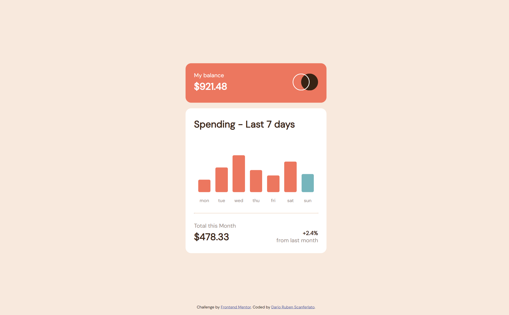

# Frontend Mentor - Expenses chart component solution

I created this chart to practice css and javascript.
This is a solution to the [Expenses chart component challenge on Frontend Mentor](https://www.frontendmentor.io/challenges/expenses-chart-component-e7yJBUdjwt). 

## Table of contents

- [Overview](#overview)
  - [The challenge](#the-challenge)
  - [Screenshot](#screenshot)
  - [Links](#links)
- [My process](#my-process)
  - [Built with](#built-with)
  - [What I learned](#what-i-learned)

## Overview

### The challenge

Users should be able to:

- View the bar chart and hover over the individual bars to see the correct amounts for each day
- See the current day’s bar highlighted in a different colour to the other bars
- View the optimal layout for the content depending on their device’s screen size
- See hover states for all interactive elements on the page
- **Bonus**: Use the JSON data file provided to dynamically size the bars on the chart

### Screenshot

### Links

- [Live Site URL](https://dariorubenscanferlato.github.io/frontend-practice-2/)

## My process

### Built with

- HTML
- CSS
- Plain JavaScript (to render the chart dinamically)
- Flexbox
- Mobile-first workflow

### What I learned

#### Snippets for Google fonts
- `<link rel="stylesheet" href="https://fonts.googleapis.com/css?family=DM+Sans">`
- `body {font-family: 'DM Sans', serif;}`

#### Spacing
- `justify-content: flex-end;` pushes everything in the end
- `justify-content: space-evenly;` creates space evenly in-beetwen
- `justify-content: space-between;` creates as much space as possible in between